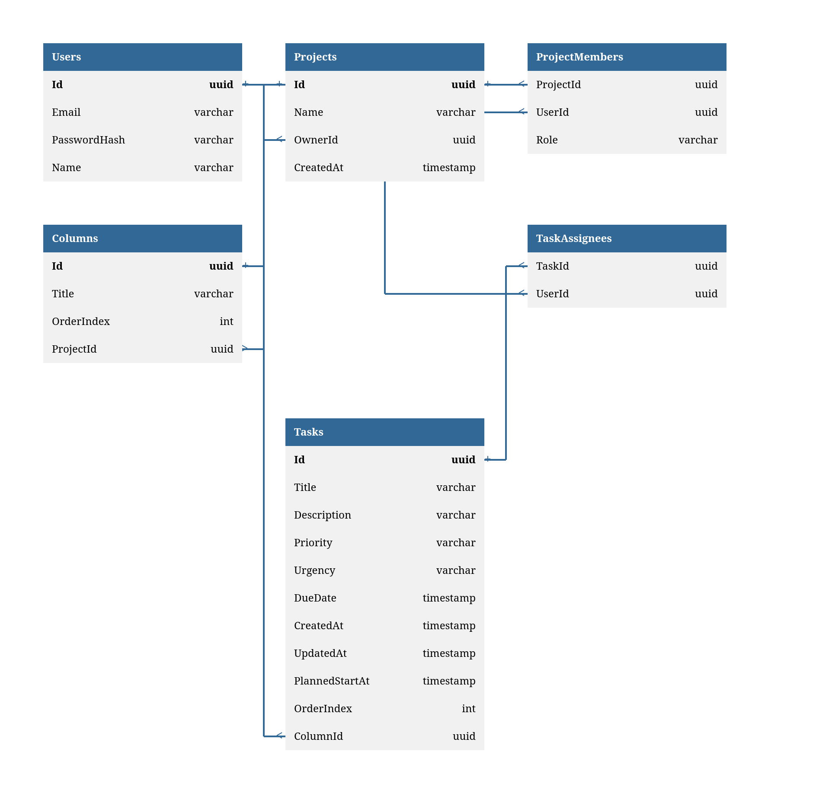

# Структура базы данных (ER-модель)
В данном документе описана структура реляционной базы данных PostgreSQL для проекта Task Tracker (MVP).
Архитектура спроектирована с учетом использования на первом этапе (MVP) и заделом для многопользовательской командной работы (Осень).



## Описание таблиц
### 1. `Users` (Пользователи)
Хранит базовую информацию о зарегистрированном пользователе системы (включая авторизацию через OAuth2).
* **Id** `(UUID)` - Уникальный идентификатор (Primary key)
* **Email** `(String)` - Уникальный email для входа и интеграции с OAuth2
* **PasswordHash** `(String)` - Зашифрованный хэш пароля.
* **Name** `(String)` - Отображаемое имя пользователя

### 2. `Projects` (Проекты/доски)
Канбан-доски.
* **Id** `(UUID)` - Уникальный идентификатор (Primary key)
* **Name** `(String)` - Название проекта
* **OwnerId** `(UUID)` - Идентификатор создателя/владельца (Foreign Key -> `Users.Id`). Используется для быстрого доступа.
* **CreatedAt** `(Timestamp)` - Дата и время создания доски.

### 3. `Columns` (Колонки)
Статусы или этапы внутри конкретной доски (например, "To Do", "In Progress", "Done").
* **Id** `(UUID)` - Уникальный идентификатор (Primary Key).
* **Title** `(String)` - Название колонки.
* **OrderIndex** `(Int)` - Порядковый номер для правильной отрисовки (слева направо).
* **ProjectId** `(UUID)` - Идентификатор проекта, которому принадлежит колонка (Foreign Key -> `Projects.Id`, `Cascade Delete`).

### 4. `Tasks` (Задача / Тикеты)
Конкретные карточки задач внутри колонок.
* **Id** `(UUID)` - Уникальный идентификатор (Primary Key).
* **Title** `(String)` - Краткий заголовок задачи.
* **Description** `(String, Nullable)` - Подробное описание.
* **Priority** `(String, Nullable)` - Приоритет задачи (например, High, Medium, Low).
* **Urgency** `(String, Nullable)` - Срочность задачи.
* **DueDate** `(Timestamp, Nullable)` - Дедлайн / плановая дата выполнения.
* **CreatedAt** `(Timestamp)` - Дата и время создания задачи.
* **UpdatedAt** `(Timestamp)` - Дата и время последнего изменения (для синхронизации и UI).
* **PlannedStartAt** `(Timestamp)` - Планируемая дата и время начала работы над задачей (для Roadmap).
* **OrderIndex** `(Int)` - Порядковый номер карточки внутри колонки (сверху вниз).
* **ColumnId** `(UUID)` - Идентификатор текущей колонки (Foreign Key -> `Columns.Id`, `Cascade Delete`).

### 5. `ProjectMembers` (Участники проекта) *[Задел на будущее]*
Таблица-связка для реализации совместного доступа (Many-to-Many).
*Примечание для разработки: В рамках MVP таблица создается, но полноценный функционал приглашения участников планируется на осень. Сейчас достаточно автоматически добавлять создателя проекта с ролью Owner.*
* **ProjectId** `(UUID)` - Уникальный идентификатор (Foreign Key -> `Projects.Id`, `Cascade Delete`). 
* **UserId** `(UUID)` - Идентификатор пользователя (Foreign Key -> Users.Id, Cascade Delete).
* **Role** `(String)` - Роль пользователя в проекте (например, Owner, Member).
* **PK** - Составной первичный ключ `(ProjectId, UserId)`.

### 6. `TaskAssignees` (Исполнители задач) *[Задел на будущее]*
Таблица-связка для назначения нескольких исполнителей на одну задачу (Many-to-Many).
*Примечание для разработки: Структура заложена под командную работу. В MVP можно использовать для назначения единственного исполнителя или пока оставить неиспользуемой на уровне API.*
* **TaskId** `(UUID)` — Идентификатор задачи (Foreign Key -> Tasks.Id, Cascade Delete).
* **UserId** `(UUID)` — Идентификатор пользователя-исполнителя (Foreign Key -> Users.Id, Cascade Delete).
* **PK** - Составной первичный ключ `(TaskId, UserId)`.

---
## Описание связей (Relationships) и индексов
* **Каскадное удаление (Cascade Delete):** Везде, где сущность логически зависит от родителя, настроено каскадное удаление. При удалении Проекта автоматически удаляются его колонки, участники и задачи. При удалении Колонки удаляются все задачи внутри неё.
* **Индексы:** Entity Framework Core автоматически создает индексы (B-Tree) для всех внешних ключей (Foreign Keys), поэтому поиск задач по `ColumnId` или колонок по `ProjectId` будет работать максимально быстро (O(log N)).
* **Связи Многие-ко-многим (N:M):** Вынесены в отдельные junction-таблицы (`ProjectMembers`, `TaskAssignees`) согласно нормальным формам реляционных БД. На старте MVP можно использовать ограниченно (назначать только одного участника/исполнителя), но структура уже готова к масштабированию.

---
## Исходный код DBML

<details>
<summary><b>Нажмите, чтобы развернуть код</b></summary>

```dbml
Table Users {
  Id uuid [primary key]
  Email varchar 
  PasswordHash varchar 
  Name varchar 
}

Table Projects {
  Id uuid [primary key]
  Name varchar
  OwnerId uuid [ref: > Users.Id]
  CreatedAt timestamp [default: `now()`]
}

Table ProjectMembers {
  ProjectId uuid [ref: > Projects.Id, delete: cascade]
  UserId uuid [ref: > Users.Id, delete: cascade]
  Role varchar [default: 'Member'] 
  Indexes {
    (ProjectId, UserId) [pk]
  }
}

Table Columns {
  Id uuid [primary key]
  Title varchar
  OrderIndex int 
  ProjectId uuid [ref: > Projects.Id, delete: cascade]
}

Table Tasks {
  Id uuid [primary key]
  Title varchar
  Description varchar [null]
  Priority varchar [null] 
  Urgency varchar [null] 
  DueDate timestamp [null] 
  CreatedAt timestamp [default: `now()`]
  UpdatedAt timestamp
  PlannedStartAt timestamp [null]
  OrderIndex int 
  ColumnId uuid [ref: > Columns.Id, delete: cascade]
}

Table TaskAssignees {
  TaskId uuid [ref: > Tasks.Id, delete: cascade]
  UserId uuid [ref: > Users.Id, delete: cascade]
  Indexes {
    (TaskId, UserId) [pk]
  }
}
```
</details>
